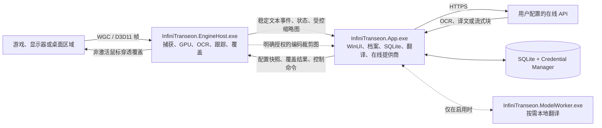
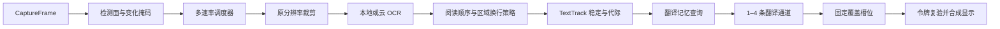

# Infini-Transeon 运行时架构设计

**状态：** 已确认，可作为前端与后端实施计划的架构依据。

**目标：** 在 Windows 11 上以可预测、可降级且不打断游戏的方式完成多目标捕获、OCR、在线翻译、可选本地翻译和原位覆盖，同时让用户通过档案自由配置目标、区域、频率、翻译通道、排版和覆盖策略。

**架构路线：** 固定主干流水线，每个捕获目标拥有独立运行上下文；昂贵的 GPU、OCR、网络和模型资源由有界共享池复用。常规运行只有 `InfiniTranseon.App.exe` 与 `InfiniTranseon.EngineHost.exe` 两个进程；只有用户主动安装并启用本地翻译模型时才启动 `InfiniTranseon.ModelWorker.exe`。

**优先级：** 不打断游戏与结果正确性 > 延迟稳定且有上限 > 资源占用 > 峰值吞吐量 > 架构灵活性。

## 1. 已确认范围

- 第一版仅支持 Windows 11 x64，API 基线为 build 22621（22H2）；发布测试矩阵覆盖当前仍受微软支持的 Windows 11 版本。不支持 Windows 10（决策见 `docs/adr/2026-07-20-adr-002-windows-11-minimum.md`），安装器必须明确拒绝不受支持的系统版本。
- 支持窗口化和无边框全屏，不保证独占全屏。
- 捕获目标统一为可捕获窗口、显示器和桌面固定区域；第一版支持同时运行多个目标。
- 不注入游戏、不读取游戏内存、不安装游戏 Hook、不接触反作弊系统。
- 用户可配置任意命名区域、排除区、剩余区域自动扫描、全目标扫描、P0–P3 优先级和独立识别频率。
- 区域坐标归一化保存，运行时映射到物理像素；窗口尺寸、DPI、显示缩放、显示器和布局变化必须重新映射或明确暂停。
- 每个区域独立配置换行、阅读顺序、OCR、翻译、覆盖和降级锁；`Attack:100 / Defense:100 / Health:200` 一类内容不使用全局换行规则。
- 每个区域支持 1–4 条翻译通道。每条通道的首个提供商可以是 NMT 或 LLM，随后可以有最多 2 个明确的 LLM 二次润色步骤。
- 多通道结果自动进入固定槽位；游戏内不要求用户挑选当前句子的“最佳译文”，也不进行 LLM 评审。
- 用户可以用作用域明确的热键切换翻译器组并重译当前可见文字，不需要切出游戏。
- 在线 OCR、翻译和 LLM 使用用户提供的密钥；支持内置中美服务适配器、OpenAI 兼容接口和声明式 REST，不支持可执行代码插件。
- 本地翻译为较低优先级能力；模型不随应用自动下载，只在用户明确请求时获取。
- 覆盖策略按区域配置：完全替换、半透明或模糊背景、偏移区域、固定或被动触发的悬浮面板。
- 历史和持久翻译记忆分别授权；两者都关闭时，文本、可逆摘要和向量不得写入 SQLite。
- 状态日志记录运行状态、错误、性能和降级，不记录 OCR 原文或译文。
- 应用开源免费，Apache-2.0；安装器与便携包通过 GitHub Releases 发布。

## 2. 明确不做的架构

- 不为每个区域创建线程、进程或完整模型实例。
- 不建立可任意拼接的通用 DAG、节点编辑器或脚本插件系统。
- 不使用无界帧队列、无界 OCR 队列或无界翻译重试。
- 不每秒对整个 4K 原始画面运行完整 OCR。
- 不自动在不同提供商、云端和本地之间改变隐私边界。
- 不用“增加队列长度”掩盖处理能力不足。
- 第一版不引入 R-tree、Hungarian 全局匹配或分布式消息总线。

## 3. 进程拓扑与信任边界



### 3.1 `InfiniTranseon.App.exe`

唯一持久数据所有者，负责：

- WinUI 3 应用外壳、托盘、设置向导、光学工作台、历史和诊断。
- 档案验证、版本迁移、原子保存和运行时不可变配置快照。
- SQLite、内存 LRU、可选持久翻译记忆与历史保留。
- 在线 OCR、NMT、LLM、OpenAI 兼容和声明式 REST 适配器。
- 翻译通道编排、上下文构建、术语表、费用和并发预算。
- EngineHost 和可选 ModelWorker 的 Job Object 监督。

在线适配器保留模块边界，但不单独建立提供商进程。因为第一版不允许代码插件，托管 HTTP 适配器通过超时、取消、响应长度、并发和主机绑定即可获得足够的故障边界。若未来允许第三方原生 SDK 或代码插件，再把相同接口移入独立 worker。

### 3.2 `InfiniTranseon.EngineHost.exe`

唯一实时图像与覆盖所有者，负责：

- Windows.Graphics.Capture、D3D11 设备和纹理生命周期。
- 低分辨率变化检测、原分辨率裁剪、多速率调度和本地 OCR。
- 文字框关联、打字机稳定、SourceEvent 和 SourceGeneration 生命周期。
- DirectComposition、Direct2D、DirectWrite 覆盖渲染。
- 窗口、显示器、桌面区域、DPI、设备丢失和覆盖可见性状态机。

完整帧不得离开 EngineHost。App 只能收到：

- 文本、框、置信度和来源元数据；
- 有尺寸与频率限制的用户预览缩略图；
- 用户明确启用云 OCR 后的单个编码裁剪图。

### 3.3 `InfiniTranseon.ModelWorker.exe`

只在用户启用本地翻译模型时启动，负责模型推理。它必须运行在没有网络 capability 的 AppContainer/LPAC 等效沙箱中，使用独立 Job Object、最小目录 ACL 和内存/进程限制。普通 restricted token 本身不能作为“无网络”的证明。模型崩溃不能带走 UI、档案数据库或实时捕获。

App 与 ModelWorker 使用单独的版本化命名管道。管道 ACL 绑定 AppContainer/package SID 和当前用户，握手绑定预期 PID、一次性 bootstrap secret 与 `WorkerSessionEpoch`；消息和队列均有硬上限。bootstrap secret 通过 `PROC_THREAD_ATTRIBUTE_HANDLE_LIST` 唯一允许的继承匿名管道 read handle 传入，握手后双方立即关闭；它不得进入命令行、环境、日志或持久文件，其他句柄一律不继承。ModelWorker 重启必须改变 epoch，使所有旧请求和旧流式结果失效。严格离线测试需要从 worker 内实际尝试 DNS 与 TCP，并验证均被阻断。

模型下载只能接收 `ModelCatalogService` 在 Ed25519 验签和 anti-rollback 接受后创建的只读 `VerifiedModelCatalog`；不得把调用者临时构造的目录条目当作已验签授权。下载 HTTP client 在显式用户批准、严格离线检查和目录解析全部通过后才允许构造。worker 管道故障会使当前请求显式失败并销毁旧会话，下一次请求创建新 `WorkerSessionEpoch`；关闭管理器必须等待进行中的请求结束。

### 3.4 IPC

App 与 EngineHost 使用带版本的受保护命名管道：

- 当前登录 SID ACL、拒绝远程客户端、随机会话名和 first-instance 保护；
- 绑定预期 PID、RuntimeEpoch 和一次性 nonce 或继承 bootstrap handle；
- 每条消息有长度上限、协议版本、请求 ID、目标实例和截止时间；
- 断线重连通过完整快照恢复，不依赖遗漏的增量消息；
- 所有双向队列有界，控制消息与大块预览或云 OCR 裁剪分开限流。

重连快照只恢复目标定义、`ProfileRevision`、区域策略和降级状态。不得重放旧 source event、云 OCR 裁剪、provider completion、流式块或覆盖文字；EngineHost 更换 `RuntimeEpoch` 后先清空全部覆盖槽位，再等待新 epoch 产生的文字。

### 3.5 版本化容量合同

App 与 EngineHost 在握手时交换 `RuntimeCapabilities`。导入档案、添加目标、增加区域、resize 和设备重建都必须先通过 admission control；超限配置保留为禁用项并显示原因，不能静默截断。

第一版协议安全上限如下，后续只能通过版本化合同调整：

```text
RuntimeCapabilities v1
├─ MaxCaptureSources = 8
├─ MaxTargets = 8
├─ MaxCaptureDimension = 8192
├─ MaxCapturePixelsPerSource = 33554432
├─ MaxRegionsPerTarget = 256
├─ MaxActiveTracksPerTarget = 512
├─ MaxOcrBoxesPerResult = 2048
├─ MaxSourceChars = 4096
├─ MaxOverlayCharsPerTarget = 16384
├─ MaxTranslationChannelsPerRegion = 4
├─ MaxOutstandingWgcFramesPerSource = 3
├─ MaxOwnedFrameTexturesPerSource = 2
├─ MaxReadbackCropsPerSource = 8
├─ MaxReadbackPixelsPerSourceRing = 8388608
├─ MaxGlobalOcrCropBytesInFlight = 134217728
├─ MaxMappedReadbacksPerAdapter = 2
├─ MaxMappedReadbackHoldMilliseconds = 20
├─ MaxDetectionPyramidBytesPerSource = 67108864
├─ MaxOverlaySurfaceBytesPerTarget = 134217728
├─ MaxOcrSessions = 4
├─ MaxOcrTensorWorkspaceBytes = 268435456
├─ MaxEngineCommittedBytes = 2147483648
├─ MaxModelWorkerCommittedBytes = 8589934592
├─ MaxGpuBytesPerAdapter = min(1073741824, 25% DXGI budget)
├─ MaxIpcMessageBytes = 8388608
├─ MaxIpcInFlightBytes = 33554432
├─ MaxRecentTranslationBytes = 5242880
├─ MaxTranslationCacheBytes = 536870912
└─ MaxDatabasePageCacheBytes = 67108864
```

这些是内存与协议安全上限，不是承诺所有机器都能同时达到的性能配置。EngineHost 和 App 还要发布可变化的 `RuntimeBudgetSnapshot`，逐池报告 limit、committed、reserved 和 available bytes/slots。运行时依据 adapter、分辨率、pixel format、OCR session 和当前预算给出更低的可用容量；前端只能依据快照展示，不自行猜测。

每个资源池使用原子 admission ledger：创建前预留峰值字节/slot，成功后把 reserved 转为 committed，失败或释放时归还。resize 与 device epoch 重建必须一次性预留旧、新资源共存峰值；预留失败时在创建任何资源前拒绝或显式降级。`MaxReadbackPixelsPerSourceRing` 是整个 ring 的聚合驻留像素，不是单 crop 限制。

## 4. 运行时所有权与并发

### 4.1 单一所有者规则

| 数据 | 唯一所有者 | 其他消费者看到的形式 |
|---|---|---|
| 档案和持久设置 | App | 带 `ProfileRevision` 的不可变快照 |
| SQLite 连接和事务 | App | 仓储接口返回的不可变记录 |
| 密钥内容 | Windows Credential Manager / App 请求边界 | 档案只保存不透明引用 |
| D3D11 设备和完整帧 | EngineHost | 纹理 lease；不跨进程 |
| 目标运行状态 | EngineHost 每目标控制邮箱 | 版本化事件快照 |
| 当前文字代际 | EngineHost 的 generation registry | 完整执行令牌 |
| 翻译通道运行 | App translation orchestrator | 不可变输出事件 |
| 覆盖窗口和槽位 | EngineHost | App 发送经令牌标记的期望状态 |

### 4.2 EngineHost 执行单元

- 每个逻辑目标有一个串行控制邮箱，只处理附加、关闭、resize、DPI、配置修订、暂停和设备纪元切换。
- `CaptureSourceRuntime` 按窗口 HWND 或 `(HMONITOR, AdapterLuid)` 唯一拥有物理 WGC session 与 latest frame。多个显示器目标或桌面固定 ROI 引用同一个物理源，不能重复创建整屏捕获池。
- WGC 捕获回调只交换最新帧 lease，不能等待 OCR、IPC、磁盘或网络。
- 每个 adapter 有一个 `DeviceRuntime` 串行提交线程，独占 D3D11 immediate context、fence、纹理池、staging ring 和 completion queue；捕获回调与 OCR worker 不得直接调用 immediate context。
- OCR 使用全局有界会话池，并有每目标并发上限。
- 一个专用 overlay 消息线程拥有 HWND/message loop、DirectComposition visual tree、D2D context 和 `Commit`；渲染只读取已提交的不可变显示快照。
- 诊断采用有界环形缓冲和批量上报，不能阻塞实时线程。

EngineHost 关闭顺序固定为：停止接收新捕获 → 隐藏覆盖 → 取消未提交工作 → 有界等待 GPU fence drain → 释放 staging/纹理池 → 关闭 WGC frame pool → 释放 device 与 HWND。超时必须记录尚未完成的资源类别，不能无限等待。

### 4.3 App 执行单元

- UI 线程只处理展示和用户意图，不执行数据库清理、HTTP、哈希大文本或图片编码。
- 每个运行目标有轻量的编排状态，不创建专属线程。
- 在线提供商共享 `HttpClient`/连接池；每个提供商、档案和全局分别受 semaphore 与 token bucket 限制。
- SQLite 通过单一写入队列执行短事务；查询使用短生命周期只读连接。
- 每个源文字的 1–4 条通道可并行，但同一通道的阶段按确定性线性顺序执行。

## 5. 固定主干数据流



### 5.1 启动与配置应用

1. App 从 SQLite 读取、迁移并验证档案，形成不可变 `ProfileSnapshot`。
2. App 启动 EngineHost，完成认证握手后发送目标和配置快照。
3. EngineHost 验证目标可捕获、几何映射、区域频率、资源上限和覆盖排除能力。
4. EngineHost 返回 `Applied`、明确拒绝原因或部分目标错误。UI 在收到确认前只显示 `Applying`。
5. 新档案修订原子替换旧快照；旧 `ProfileRevision` 的异步结果全部失效。

### 5.2 捕获与变化判断

1. WGC 交付物理 `CaptureSourceRuntime` 的 `CapturedFrame`，逻辑目标引用相同源帧与各自 ROI；帧包含序号、QPC、尺寸、DPI、adapter LUID 和 device epoch。
2. EngineHost 保持 `Direct3D11CaptureFrame` 到最后一次 GPU 使用完成；若要脱离 WGC 生命周期，必须实际执行 `CopySubresourceRegion` 到引擎拥有的纹理，GPU 提交后才能关闭原 frame。仅取得 `ComPtr` 引用不等于复制纹理。
3. GPU 生成最长边不超过 1920 的检测面和 tile 变化摘要。
4. 已知用户区域按各自频率执行轻量变化检查；剩余区域自动检测使用独立默认频率，初始约为 1 Hz。
5. 无变化区域结束本次工作，不进入 OCR。
6. 小文字使用变化触发的原分辨率 tile 或图像金字塔裁剪，不依赖缩小后的 OCR。

### 5.3 区域与剩余画面

- `AreaMode` 为 `UserRegion | FullTarget | RemainingArea`。
- 剩余区域掩码等于目标范围减去用户区域和排除区。
- 用户区域优先于自动发现框；重叠框按 IoU、包含关系和文字相似度去重。
- 显示器或桌面固定区域跨显示器时，拆成每显示器物理像素子 ROI，再合成逻辑结果。
- 归一化区域在窗口大小或 DPI 改变后重新计算并 clamp 到实际物理像素。

### 5.4 OCR 与文字稳定

1. 自动检测先产生 `DetectionWorkItem{TargetInstanceId, CaptureAreaKey, CaptureFrameRef, DetectionEpoch, ProfileRevision, deadline}`，不携带 `TextTrackId` 或 `SourceEventId`。`CaptureFrameRef` 绑定物理源、帧序号、device epoch 和 frame lease。固定用户区域可跳过文字检测，但仍进入同一候选跟踪步骤。
2. 检测输出有界的 `DetectionCandidate{DetectionCandidateId, bounds, DetectionEpoch}`。几何与时间跟踪先关联已有轨迹或分配 provisional `TextTrackId`。
3. 每个轨迹视觉变化推进 recognition/source generation。GPU 从对应 frame ticket 复制出有界不可变 `CropLease` 后释放根帧 ticket，再生成 `RecognitionWorkItem{SourceGenerationToken, CropLeaseId, frameMetadata, priority, deadline, reason}`；此时仍没有 `SourceEventId`。
4. 本地 OCR 只消费原分辨率裁剪；云 OCR 只消费用户授权的编码裁剪，并额外派生 `OcrExecutionToken` 区分 run、attempt 和结果序号。
5. CPU OCR 路径先在 GPU 上裁剪和预处理，只把 crop 复制进固定容量 staging/readback ring。DeviceRuntime 在 fence 完成后只执行 Map/Unmap 与状态转换，把 `MappedReadbackLease` 交给有界 OCR-prep worker 完成 memcpy/normalize；worker 完成后投递 Unmap。每 adapter 最多 2 个同时映射 lease、单次调度最多复制 4 MiB，持有超过 20 ms 即取消并记录。禁止同步读取完整帧，也禁止在唯一 GPU 提交线程上执行大块 CPU copy。
6. OCR 结果保留框、行、置信度、方向、模型和原始顺序。
7. 区域换行策略执行保留行、合并段落、键值行、自定义分隔符或逐框翻译。
8. 打字机文字使用最小稳定帧、最小等待和最大等待；达到最大等待时可以推进新 generation，但不能复用旧结果。
9. 识别文本首次稳定时创建 `SourceEventId` 并提交当前 pending generation。只有在区域配置的 typewriter continuation window 内、且新文本是旧规范化文本的前缀扩展时才沿用 event 并提交新 generation；稳定文本替换、清空后重现、窗口超时、语义 reset、merge 或 split 都结束旧 event 并创建新 `SourceEventId`。continuation window 可配置但硬上限为 5 秒。

### 5.5 翻译与二次润色

1. App 接收 `TextGeneration` 后先查询有界内存 LRU；只有用户授权时才查询持久翻译记忆。
2. 缓存键绑定提供商、模型、语言对、规范化原文、提示版本、术语表版本、档案策略和影响输出的上下文摘要。
3. 1–4 条通道并行启动，每条通道获得固定 `ImmutableSlotId`。
4. 每条通道首阶段可以直接使用 NMT 或带游戏名、描述、场景、说话人、术语表和有限最近上下文的 LLM。
5. 首译后可以执行最多 2 个用户明确配置的 LLM 二次润色步骤。每个固定槽携带阶段编号；二次润色必须先满足该区域的最短阅读停留时间，再只对原槽做透明度交叉过渡。全局“减少动态效果”保留阅读停留但将过渡时长置零，流式首译的逐字更新不得触发该动画。
6. 每次提供商尝试最多 1 次有限重试、最多 2 个备用提供商；失败只改变该槽位，不阻塞其他通道。
7. Provider adapter 在进程内用连续 `ProviderDeltaSequence` 验证并组装原始 delta；原始 delta 缺口会终止 attempt。对外只发布累计 `TextSnapshot`，其 `StageExecutionToken.StreamSequence` 是可合并的单调 snapshot revision，允许因背压跳号；旧 revision 和非法终态被拒绝。
8. 不存在自动评审、候选获胜或游戏内逐句选择。

### 5.6 覆盖与生命周期结束

1. App 按目标发送带单调 `OverlayRevision` 的完整不可变 desired-state snapshot，其中包含所有槽位的 `Waiting | Streaming | Success | Fallback | Timeout | Failure | Cancelled` 状态；不发送必须逐条应用的 overlay delta。
2. EngineHost 复验 source、channel 和 stage 完整令牌后才更新覆盖。
3. EngineHost 可以 latest-wins 丢弃中间 snapshot，但必须回报最后应用的 `OverlayRevision`；槽位位置固定，状态变化不能导致其他结果跳动或重新排列。
4. 覆盖窗口不激活、鼠标穿透、隐藏于任务栏和 Alt+Tab，并必须成功从捕获中排除。
5. 如果捕获排除失败，停止受影响覆盖并报告错误，不能冒险形成 OCR 反馈环。
6. 轨迹消失后进入短保留期；超过期限则清除覆盖、取消工作并按授权写入历史。

## 6. 执行令牌与一致性

```csharp
public sealed record SourceGenerationToken(
    Guid RuntimeEpoch,
    TargetInstanceId TargetInstanceId,
    CaptureAreaKey Area,
    TextTrackId TextTrackId,
    long SourceGeneration,
    long ProfileRevision);

public enum CaptureAreaKind { UserRegion, FullTarget, RemainingArea }
public sealed record CaptureAreaKey(CaptureAreaKind Kind, RegionId? UserRegionId);

public sealed record OcrExecutionToken(
    SourceGenerationToken Source,
    Guid OcrRunId,
    int Attempt,
    long ResultSequence);

public sealed record ChannelExecutionToken(
    SourceGenerationToken Source,
    TranslationChannelId ChannelId,
    Guid ChannelRunId,
    Guid ImmutableSlotId);

public sealed record StageExecutionToken(
    ChannelExecutionToken Channel,
    Guid StageId,
    int StageSequence,
    int Attempt,
    long StreamSequence);
```

规则：

- OCR 工作先使用 `SourceGenerationToken` 标识当前轨迹 generation；每次本地或云 OCR run/attempt 再派生 `OcrExecutionToken`，注册表只接受当前 attempt 和连续结果序号。
- `CaptureAreaKey.UserRegion` 必须携带 RegionId；`FullTarget` 和 `RemainingArea` 禁止伪造持久区域 ID。检测键、策略解析、source token、诊断和历史来源都使用同一个可序列化 area key。
- 每条翻译通道派生自己的 `ChannelExecutionToken`。
- 每次提供商尝试、fallback、流式序列和润色阶段派生 `StageExecutionToken`。
- `RuntimeEpoch` 在 EngineHost 重启后变化；`TargetInstanceId` 在窗口重新附加后变化。
- 配置改变增加 `ProfileRevision`；文字改变增加 `SourceGeneration`。
- 所有结果在产生端、IPC 接收端、App 状态仓库和覆盖提交端分别验证。
- 取消是资源优化，令牌验证才是正确性保证。

## 7. 关键数据结构

### 7.1 变量定义

| 符号 | 含义 |
|---|---|
| `M` | 同时活动的逻辑目标数，硬上限 8 |
| `V` | 唯一物理捕获源数，`V ≤ M` |
| `P` | 原始捕获帧像素数 |
| `Pd` | 最长边不超过 1920 的检测面像素数 |
| `R` | 一个目标的配置区域数 |
| `T` | 活跃文字轨迹数 |
| `B` | 一次 OCR 返回的文字框数 |
| `Escan` | 空间网格实际扫描的旧轨迹条目数；最多访问 9 cells、每 cell 最多 32 条，`Escan ≤ 288B` |
| `Escore` | 进入评分的候选边数；每框最多 8 条，`Escore ≤ 8B` |
| `Q` | 本次实际 OCR 裁剪总像素数 |
| `L` | 当前原文字符数 |
| `Ctx` | 参与缓存键和提示的上下文字符数 |
| `K` | 翻译通道数，硬上限 4 |
| `S` | 一条通道阶段数，首译加最多 2 次润色 |
| `H` | 持久历史或翻译记忆记录数 |
| `U` | 当前覆盖层显示的总字符数 |

### 7.2 目标注册表

```text
HashMap<TargetInstanceId, TargetRuntime>
HashMap<CaptureSourceKey, CaptureSourceRuntime>

TargetRuntime
├─ ProfileSnapshot
├─ TargetControlMailbox
├─ CaptureSourceKey + SourceRoi
├─ Vector<RegionDefinition>
├─ HashMap<RegionId, RegionRuntimeState>
├─ HashMap<TextTrackId, TextTrack>
├─ UniformTrackGrid
├─ RegionSchedulerState
└─ OverlayTargetState
```

目标和物理源查找平均 `O(1)`。`CaptureSourceKey` 为窗口 HWND，或 `(HMONITOR, AdapterLuid)`。目标关闭时整体销毁其运行上下文；只有最后一个引用目标离开时才关闭共享 CaptureSourceRuntime。

### 7.3 区域

- `RegionDefinition` 是用户配置的不可变记录。
- `RegionRuntimeState` 保存下次到期时间、降级状态、统计和最近变化摘要。
- 第一版以连续 `Vector<RegionDefinition>` 保存区域；典型数量小于 100，遍历 `O(R)`，比树结构更简单且缓存局部性更好。
- 自动发现轨迹使用固定 cell 尺寸的均匀空间网格；不为少量用户区域引入 R-tree。

### 7.4 帧资源

```text
CaptureSourceRuntime
├─ WgcCaptureSession
├─ LatestFrameSlot
├─ FrameSequence
├─ DeviceEpoch
├─ OutstandingWgcFrames[0..3]
├─ OwnedFrameTextures[0..2]
└─ ReadbackRing[0..8]

FrameLease
├─ RootState: Captured → Published → Retired → Released
├─ LatestSlotReference
└─ GpuUseTicket[0..bounded]
   └─ Acquired → Submitted(FenceValue) → FenceCompleted → Released
```

每个物理捕获源只保留最新 slot 和固定资源池。多个逻辑目标从同一根 lease 获取独立 `GpuUseTicket`；取消未提交 ticket 立即释放，已提交 ticket 只能由对应 fence completion 释放。slot 引用和全部 ticket 同时归零后才能关闭 `Direct3D11CaptureFrame`。脱离 WGC 生命周期时，必须完成实际纹理 copy 提交，不能把 `ComPtr` 引用增加当成复制。

DetectionWorkItem 必须携带 `CaptureFrameRef{CaptureSourceKey, FrameSequence, DeviceEpoch, FrameLeaseId}`。RecognitionWorkItem 不长期钉住整帧，而是携带从该帧实际复制出的不可变 `CropLeaseId` 和 frame metadata；crop pool 同样受 admission ledger 限制。

device epoch 切换时先拒绝旧 epoch 新提交、取消未提交任务，再由 DeviceRuntime 有界 drain 已提交 fence；完成后释放旧资源。resize、device removal 和 shutdown 都执行相同所有权规则。读写 latest slot 为 `O(1)`，资源数不随帧数增长。

### 7.5 文字轨迹

```text
TextTrack
├─ TextTrackId
├─ SourceEventId
├─ TrackEpoch
├─ CurrentBounds / PreviousBounds
├─ StableTextDigest
├─ StableFrameCount
├─ SourceGeneration
├─ LastSeenQpc
├─ LifecycleState
├─ CancellationHandles
└─ ImmutableOverlaySlots[1..4]
```

`LifecycleState` 为 `Candidate | Stabilizing | Active | Disappearing | Expired`。轨迹匹配最多访问相交的 9 个网格 cell，每 cell 最多扫描 32 条活跃轨迹，然后按 IoU、中心距离、尺寸、文本相似度和时间连续性保留最多 8 个评分候选。新框以 `(top, left, DetectionCandidateId)` 稳定顺序遍历；同分按 `TextTrackId` 决定，避免全局边排序。cell 超限时不扫描 overflow 强制匹配，而是细分 cell；细分仍超限则建立关联不确定的新 candidate track 并发送诊断。

候选数达到硬上限时，宁可建立新的 candidate track 并记录关联不确定性，也不能为了省时间把文字错误关联到已有事件。轨迹过期时必须同时删除空间网格引用、latest-work 槽位和 generation registry 条目。

### 7.6 调度器

```text
IndexedMinHeap<ScheduledRegion>  // 下一次到期时间
ReadyQueue[P0..P3]               // 四个优先级
WeightedDeficit<TargetId, Priority> // 目标与优先级二维公平
HashMap<DetectionKey, LatestWorkSlot> // 关联前：每 area/detection epoch 容量 1
HashMap<TrackStageKey, LatestWorkSlot> // 关联后：每轨迹/阶段容量 1
Semaphore GlobalOcrLimit
Semaphore PerTargetOcrLimit
```

- 定时任务插入和取出为 `O(log N)`。
- ReadyQueue 入队和出队摊销 `O(1)`。
- latest-wins 替换平均 `O(1)`。
- 二维 weighted-deficit 选择下一目标和优先级摊销 `O(1)`，初始权重为 P0:P1:P2:P3 = 8:4:2:1。
- 同优先级内部按 deadline 选择；P0 连续提交最多 8 个后，若存在仍符合 admission policy 的较低优先工作，必须给它一次配额。
- 等待超过 `max(configuredInterval, 500 ms)` 的工作每次提升一个有效调度等级，但不能越过用户设置的硬截止时间和资源上限。
- P0 不意味着无限并发；所有优先级仍受硬容量限制。
- 若负载已经超过容量，治理器必须显式延长、暂停或报错，使不可满足的工作不再伪装成“仍可调度”；禁止用永久饥饿隐藏过载。

### 7.7 翻译缓存

```text
HashMap<TranslationCacheKey, LruNode>
DoublyLinkedList<LruNode>
```

缓存键计算为 `O(L + Ctx)`，键命中、提升和淘汰平均 `O(1)`。容量按字节而不是只按条目数限制。持久翻译记忆使用 SQLite B-tree 索引，精确查询 `O(log H)`。

### 7.8 诊断

- 实时性能采样使用固定容量环形缓冲，写入 `O(1)`。
- 延迟分布使用有界 HDR Histogram 或等价固定桶直方图，不能保留每次请求的无限样本。
- 相同错误按稳定 error code、目标和阶段聚合并限频。

## 8. 时间与空间复杂度

| 阶段 | 时间复杂度 | 空间复杂度 | 边界说明 |
|---|---:|---:|---|
| 获取 WGC 帧 | `O(1)` | `O(Σsource rowPitch × height × frameCount)` | 交接 GPU 资源；frameCount 有硬上限 |
| 生成检测面 | `O(Pd)` | `O(Pd)` | GPU 执行；最长边限制 1920 |
| 变化检测 | `O(Pd)` | `O(tileCount)` | 静态区域之后停止 |
| 遍历用户区域 | `O(R)` | `O(R)` | 第一版不使用空间树 |
| 调度到期任务 | `O(log N)` | `O(N)` | `N` 有配置与硬容量上限 |
| OCR | `Fmodel(Q)` | 模型固定工作区 + `O(Q)` | 只处理变化裁剪；DNN 不伪装成简单线性复杂度 |
| OCR 框阅读顺序 | `O(B log B)` | `O(B)` | 按方向、行和位置排序 |
| 轨迹关联 | `O(B + Escan)` | `O(B + T + Escore)` | `Escan ≤ 288B`、`Escore ≤ 8B`；不做全局边排序 |
| 文本规范化 | `O(L)` | `O(L)` | 单次或少量线性 pass |
| 术语表匹配 | `O(L + matches)` | `O(glossary)` | 使用 Aho-Corasick 或等价多模式自动机 |
| 翻译缓存查询 | `O(L + Ctx)` | `O(cacheByteLimit)` | 哈希后平均 `O(1)` |
| 通道启动 | `O(K)` | `O(K × S)` | `K ≤ 4`、`S ≤ 3`，重试与 fallback 也有硬上限 |
| 覆盖排版 | `O(U)` | `O(U)` | 固定槽位，无结果比较 |
| 历史查询 | `O(log H + pageSize)` | `O(pageSize)` | 复合索引 + keyset cursor；禁止深页 `OFFSET` |

总体运行内存上限：

GPU/CPU 图像资源必须按实际字节计算，不能只用像素个数估算：

```text
PeakImageBytes = ΣcaptureSource(
    WgcPoolRowPitch × Height × WgcFrameCount
  + OwnedTextureRowPitch × Height × OwnedTextureCount
  + DetectionPyramidBytes
  + OverlaySurfaceBytes
  + ReadbackRingBytes)

PeakRuntimeBytes = PeakImageBytes
  + OcrSessionAndTensorWorkspaceBytes
  + Σtarget(O(R + T + T × K × S))
  + IpcInFlightByteLimit
  + RecentTranslationByteLimit
  + TranslationCacheByteLimit
  + DatabasePageCacheLimit
```

`rowPitch × height` 自动覆盖 BGRA8、FP16/HDR 和对齐差异。device epoch 重建的 admission control 必须按旧、新资源短暂同时存在的峰值计算。创建目标、resize、增加区域或提高并发超过预算时，只能明确拒绝、降低用户允许的检测分辨率/并发，或进入暂停状态，并发送包含所需和可用字节的诊断事件。

内存不得与累计帧数、运行时长、网络延迟或失败重试次数成正比。基准测试必须读取实际 committed CPU/GPU bytes，并断言池容量与 `RuntimeCapabilities` 一致。

## 9. 性能策略与预算

### 9.1 多速率调度

- P0 字幕和对话：变化触发，满足最短间隔后尽快运行。
- P1 角色名和主要提示：较高频率，但可被当前 P0 截止时间抢占。
- P2 菜单和说明：用户配置的中等频率。
- P3 地图、低优先区域和剩余画面：低频运行，默认可被降级延长。
- 每个区域的频率、优先级和是否允许降级均由用户覆盖。

### 9.2 Backpressure

- 捕获：只保留最新帧。
- 关联前检测：每个 `TargetInstanceId + CaptureAreaKey` 只保留最新 detection epoch。
- 关联后识别：每个 `TextTrackId + recognition stage` 容量 1。
- 翻译：相同通道运行切换后取消旧请求，旧结果由令牌拒绝。
- Provider 流式输出：adapter 内部 `ProviderDeltaSequence` 必须连续，缺口终止 attempt；向上层发布的累计 snapshot revision 只需单调递增并允许合并跳号，终态携带完整最终文本和最后 delta sequence。
- App → EngineHost 覆盖：每目标容量 1 的完整 desired-state snapshot，EngineHost 确认最后应用 revision；中间状态可丢，最终状态不能依赖旧增量。
- 历史与日志：批量短事务；写入压力不得反向阻塞捕获或覆盖。

### 9.3 候选门槛

这些数值在完成硬件矩阵校准前是候选门槛，不是营销保证：

| 指标 | 候选目标 |
|---|---:|
| 无活动捕获时 CPU | `< 1%` |
| 静止画面、无新文字时 CPU | `< 2%` |
| 覆盖渲染 P95 | `< 2 ms` |
| 内存翻译缓存命中 P95 | `< 10 ms` |
| P0 区域本机未缓存路径 P95（变化检测→OCR→翻译请求发出，不含提供商网络） | `< 300 ms` |
| 未加载本地翻译模型时基础 RAM | `< 400 MB` |

每次基准必须记录：CPU、GPU、RAM、VRAM、目标数量、目标分辨率、区域数、文字密度、OCR 模型、采样窗口和 P50/P95/P99。在线提供商延迟单独报告，不能作为应用可控制的硬门槛。

WGC 帧到达频率只能表示捕获压力，不能宣称为游戏实际 FPS；性能治理不得基于无法可靠观测的游戏帧率作出决定。

### 9.4 性能治理

预设 `Eco | Balanced | Performance | Custom` 只是初始值。治理器只能按文档执行：

1. 延长允许降级的 P3/P2 区域间隔；
2. 降低剩余画面检测频率；
3. 暂停可选剩余画面扫描；
4. 选择用户已配置并允许的较小 OCR 模型；
5. 暂停可选二次润色。

降级需要 hysteresis 和最小驻留时间，恢复时逆序撤销。所有变化显示、记录并带原因。用户锁定的区域永不自动改变；如果 OOM、设备丢失或硬容量无法满足，丢弃旧工作并把该区域显式置为暂停或错误。

## 10. 可复用性设计

复用通过小型稳定接口与不可变数据实现，不通过通用工作流引擎实现。

### 10.1 稳定接口

```csharp
public interface ICaptureProbe
{
    Task<CaptureProbeResult> ProbeAsync(CaptureTarget target, CancellationToken ct);
}

public interface IOcrProbe
{
    Task<OcrProbeResult> ProbeAsync(OcrProbeRequest request, CancellationToken ct);
}

public interface ITranslationProvider
{
    IAsyncEnumerable<ProviderEvent> StreamAsync(
        TranslationRequest request,
        CancellationToken ct);
}

public abstract record ProviderEvent(StageExecutionToken Execution);
public sealed record ProviderSnapshot(
    StageExecutionToken Execution,
    long LastProviderDeltaSequence,
    string CumulativeText) : ProviderEvent(Execution);
public sealed record ProviderCompleted(
    StageExecutionToken Execution,
    long LastProviderDeltaSequence,
    string FinalText,
    ProviderUsage Usage) : ProviderEvent(Execution);
public sealed record ProviderUsage(
    long? InputTokens,
    long? OutputTokens,
    decimal? EstimatedCost,
    string? Currency,
    bool EstimateOnly);
public sealed record ProviderFailed(
    StageExecutionToken Execution,
    string ErrorCode,
    bool Retryable) : ProviderEvent(Execution);
public sealed record ProviderCancelled(
    StageExecutionToken Execution,
    string ReasonCode) : ProviderEvent(Execution);

public interface ITranslationProbe
{
    Task<TranslationProbeResult> ProbeAsync(TranslationProbeRequest request, CancellationToken ct);
}

public interface IOverlayPreviewRenderer
{
    OverlayPreview Render(OverlayPreviewRequest request);
}

public interface IClock
{
    DateTimeOffset UtcNow { get; }
    long GetTimestamp();
}
```

`Execution.StreamSequence` 是对外唯一排序 revision；它必须单调递增但允许跳号，不得在事件 DTO 中维护第二个外部排序值。`LastProviderDeltaSequence` 只是 adapter 内部连续 delta 的进度/终态证明，不参与外部快照排序。每次枚举必须产生唯一终态 `ProviderCompleted`、`ProviderFailed` 或 `ProviderCancelled`。provider service 将取消异常映射为更高 revision 的 `ProviderCancelled`。`ProviderSnapshot` 永远是完整累计文本，不是不可丢失 delta。可序列化 DTO 与事件语义是未来跨 worker 复用的边界，不能假定 C# 接口对象本身跨进程。

原生侧使用同样职责边界的 C++ 抽象：`ICaptureSource`、`IOcrEngine`、`IOverlayRenderer`、`IPerformanceSampler`。跨 C ABI 只暴露不透明 handle、显式结构大小、ABI 版本、UTF-8、分配和释放所有权；C++ 异常与 C# 异常都不能跨 ABI。

### 10.2 策略作为数据

以下能力通过版本化档案记录复用，而不是派生大量区域子类：

- 捕获目标与归一化几何；
- 预处理步骤和参数；
- 换行与阅读顺序；
- 优先级、频率和降级许可；
- 翻译通道、fallback、retry、润色和上下文权限；
- 覆盖背景、字体、颜色、偏移、槽位和溢出；
- 历史、缓存和隐私授权。

### 10.3 可测试替身

- `VirtualCaptureSource` 提供确定性帧、resize、DPI、设备丢失和目标关闭事件。
- `FakeOcrEngine` 返回可控制延迟、错误、框和打字机序列。
- `FakeTranslationProvider` 支持流式乱序、429、超时、取消、fallback 和费用结算。
- `GoldenOverlayRenderer` 验证固定槽位、换行、缩放和不重排。
- `VirtualClock` 驱动调度、hysteresis、保留期和重试，不在测试中真实 sleep。

### 10.4 YAGNI 边界

- 新增提供商实现 `ITranslationProvider` 或声明式 REST schema，不改变调度器。
- 新增 OCR 模型实现 `IOcrEngine`，不改变目标生命周期。
- 新增覆盖策略实现有限的 renderer policy，不允许任意代码插件。
- 只有实际基准证明 `Vector` 或均匀网格成为瓶颈后，才评估 R-tree、BVH 或更复杂匹配。

## 11. 持久化与索引

SQLite 仅由 App 打开。WAL 只在受支持的本地文件系统启用；网络盘、可移动或不支持的文件系统使用安全 journal mode。

App 拥有独立于档案的版本化 `ApplicationSettings{UiLanguage, FormattingRegionMode, FormattingRegion}`。界面语言和日期/数字格式区域分别选择；协议、缓存键和 SQLite 数值始终使用 invariant culture 与明确 UTF-8，不得随当前界面文化变化。

App 还拥有按档案分区的有界内存 `RecentTranslationBuffer`，保存最近 200 个 source event 或 5 MiB 文本，以先达到者为准，并提供只读快照查询。它用于“最近译文”面板，不等同于历史：历史关闭时不写 SQLite；停止档案、用户清空或退出应用时立即清除相应内存。

建议核心表与索引：

| 表 | 主键／主要索引 | 保存条件 |
|---|---|---|
| `ApplicationSettings` | `SettingsVersion` | 始终，独立于档案 |
| `Profiles` | `ProfileId`, `Revision` | 始终 |
| `ProfileTargets` | `ProfileId, TargetId` | 始终 |
| `ProfileRegions` | `ProfileId, RegionId, Order` | 始终 |
| `TranslationChannels` | `RegionId, ChannelId, SlotOrder` | 始终 |
| `RuntimeStatusEvents` | `TimestampUtc, ErrorCode, TargetId` | 始终，不含文本 |
| `HistorySourceEvents` | `ProfileId, CapturedAtUtc, SourceEventId` | 仅历史授权 |
| `HistoryChannelOutputs` | `SourceEventId, ChannelId, StageSequence` | 仅历史授权 |
| `TranslationMemory` | `ProfileId, CacheKeyHash, LastUsedUtc` | 仅持久记忆授权 |
| `Corrections` | `ProfileId, Scope, NormalizedSourceHash` | 用户明确保存修正 |

密钥只进入 Windows Credential Manager。档案导出自动排除密钥、历史、截图、模型、日志和个人路径。

历史分页禁止使用深页 `OFFSET`。使用 `(ProfileId, CapturedAtUtc DESC, SourceEventId DESC)` 复合索引和相同字段的 keyset cursor，才能保持 `O(log H + pageSize)`；测试必须覆盖百万级合成记录后的深游标页。

## 12. 故障、恢复与沉浸感

| 故障 | 必须行为 |
|---|---|
| EngineHost 崩溃 | App 显示非模态状态；Job Object 清理；有限重启；RuntimeEpoch 改变，旧结果失效 |
| App 崩溃或退出 | Job Object 终止 EngineHost，立即清除覆盖，不留下孤儿窗口 |
| ModelWorker 崩溃 | 只使受影响本地通道失败；其他在线通道继续 |
| 在线提供商超时/429/5xx | 受限重试或配置 fallback；不阻塞其他槽位 |
| D3D device removed | 暂停相关目标、释放旧 epoch 资源、重建设备并发送完整状态 |
| 目标关闭或重建 | 新 TargetInstanceId；取消旧工作；不得把旧译文画到新窗口 |
| DPI/resize storm | 合并中间几何事件，只应用最新稳定布局；旧坐标结果失效 |
| 覆盖排除失败 | 禁止该覆盖并显示兼容错误，不能继续产生捕获反馈 |
| SQLite 迁移失败 | 回滚事务并从验证过的备份恢复；明确报告，不伪装成功 |
| 所有区域均锁定且过载 | 丢弃旧工作并显式暂停，不偷偷降低设置 |

游戏运行时禁止模态框、焦点抢夺、鼠标捕获和需要点击的覆盖控件。常规状态使用托盘徽标、短暂非激活角落提示和诊断页；最近译文面板由用户通过热键或托盘主动打开，并明确切换焦点。

## 13. 隐私与安全不变量

- 严格离线模式不构造在线 provider 或 update HTTP client，不执行 DNS、health check 或更新检查。
- 云 OCR 裁剪请求必须包含 `OcrExecutionToken`、同意策略版本、编码、尺寸、字节上限和截止时间。
- 声明式 REST 只允许白名单模板变量、有限 JSON selector 和 SSE framing，不允许脚本、动态程序集或命令执行。
- credential reference 绑定 provider ID、scheme、host、port、认证用途和 proxy policy；origin 或认证模板变化要求重新确认。
- 每个 `(provider, origin, proxy policy)` 使用隔离的 HTTP handler/连接池，禁用 cookie。自动重定向默认关闭；若适配器明确允许逐跳重定向，每一跳都必须重新验证 origin，且认证头和请求体不得跨 origin 转发。
- 使用 `ResponseHeadersRead` 流式读取；同时限制 header、压缩前后总字节、JSON 深度、SSE 单事件、累计字符/token、持续时间和无数据超时，防止 307/308 凭据泄漏、压缩炸弹、慢响应和无限流耗尽 App。
- 发送前原子预留最坏费用，结束后结算；未知价格标记为估算，不能声称严格货币上限。
- 默认崩溃包只有结构化元数据、模块和版本，不包含进程内存。内存转储需要单独同意、私有 ACL、短保留和明确风险提示。

## 14. 必须持续验证的系统不变量

1. 两个 4K 目标运行 30 分钟，所有队列长度、内存和纹理池保持有界。
2. 静态画面不会周期性触发整张原始 4K OCR。
3. 新 source generation 出现后，所有旧 OCR、翻译、流式块、润色和覆盖更新均被拒绝。
4. 切换翻译器组、档案修订、目标重建和 EngineHost 重启后，旧结果不能回到屏幕。
5. 多通道任何一个失败不会使其他固定槽位重新排序或消失。
6. 两个目标之间保持公平；持续 P0 负载不能永久饿死允许执行的低优先区域。
7. 严格离线模式对完整进程树执行网络阻断测试并确认零 DNS/socket 尝试。
8. 历史关闭且持久记忆关闭时，SQLite 不出现原文、译文、可逆摘要或 embedding。
9. Overlay 操作不改变前台 HWND、键盘焦点 HWND 或 mouse capture HWND。
10. 窗口 resize、DPI、跨显示器、最小化、虚拟桌面和 device reset 后，区域映射正确或显式暂停。
11. 云 OCR 第一次 attempt 迟到时不能覆盖当前 attempt；provider 307/308、压缩炸弹、无限 SSE 和跨 origin 认证转发均被拒绝。
12. 历史关闭时“最近译文”只来自有界内存，停止档案后没有文本残留；深分页使用 keyset，不随页码线性变慢。

## 15. 实施映射

- 后端 Task 0 与前端 Task 0 先验证平台边界假设：WGC 捕获边框关闭（`IsBorderRequired` 与 `GraphicsCaptureAccess.RequestAccessAsync` 用户授权流程，含拒绝授权与重启后的行为）、捕获排除与反馈环、热键在 raw-input 游戏下的送达、托盘与焦点保持；结论回写本规格与产品沉浸感合同后，才能开始对应正式实现。
- 后端任务 1–4 建立合同、IPC、档案、捕获和几何所有权。
- 后端任务 5–7 实现检测面、调度器、OCR、文字布局和轨迹生命周期。
- 后端任务 8–10 实现 App 内在线适配器、翻译通道、上下文、缓存和术语表。
- 后端任务 11–12 实现覆盖、性能治理和可见降级。
- 后端任务 13–16 实现历史、可选 ModelWorker、签名更新和端到端基准。
- 前端任务通过 `ICaptureProbe`、`IOcrProbe`、`ITranslationProbe` 和 `IOverlayPreviewRenderer` 的确定性替身并行开发，真实集成按后端任务门槛启用。

本规格是运行时结构、所有权、复杂度和性能决策的唯一依据。产品行为以 `docs/product/2026-07-19-product-ux-architecture-review.md` 为准，具体文件与 TDD 步骤以对应前端和后端实施计划为准。
